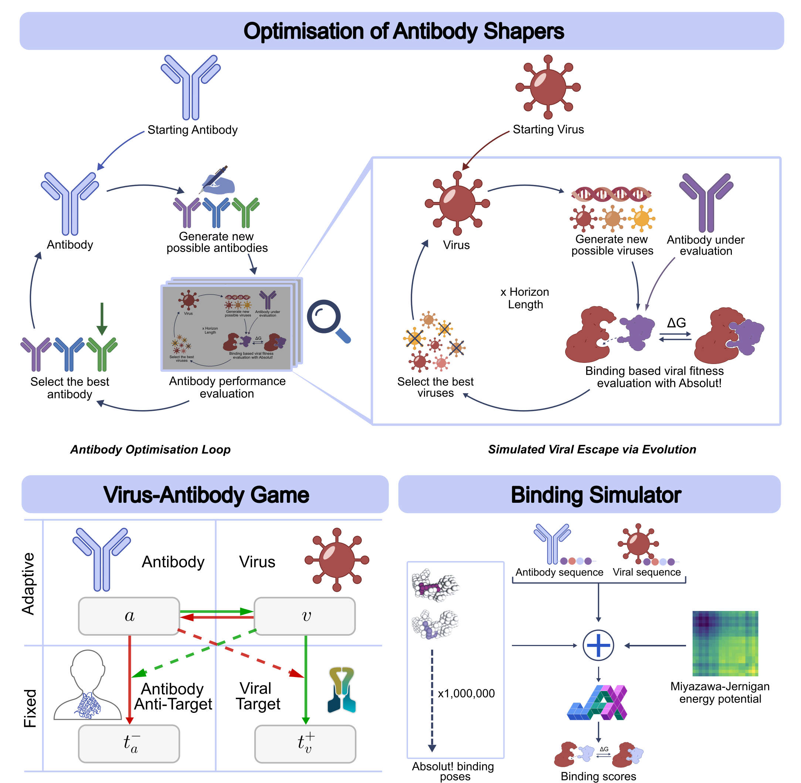

# Opponent Shaping for Antibody Development

This is our implementation of the paper on [Opponent Shaping for Antibody Development](https://arxiv.org/abs/2409.10588).



It consists of a few elements:
* JAX-accelerated binding simulation, using the [Absolut! framework](https://www.nature.com/articles/s43588-022-00372-4) as a base - `binding/*`
* Simulated viral escape via evolution - `gen_alg_basic.py` and `shaping_func.py`
* Optimisation of antibody shapers - `main_shaping_process.py`

## Installation

```bash
git clone https://github.com/olakalisz/antibody-shapers.git
cd antibody-shapers
pip install .
```
This should install the necessary requirements too.

## Usage

To get started first you'll need to download the Dengue Antigen data that we used throughout our experiments. We made a [GDrive folder](https://drive.google.com/drive/folders/18b5eF7YMfuH6p6LnLA1RTQOiT4UknUWC?usp=sharing) with all the relevalnt files. Download the files and move them to the `./data` directory in the repository.


You can run an example simluated viral escape to a random antibody in a following way:
```bash
python src/antibody_shapers/shaping_funcs.py
```

This should create a `./results/test_run_results.pkl` file. You can investigate the outputs by loading:
```python
import pickle as pkl
with open(f"./results/test_run_results.pkl", "rb") as f:
        test = pkl.load(f)
```
As an example `test["ag_performances"]` contains the viral fitness values for a full 100 horizon steps escape trajectory.

Our code also allows for an easy calculation of binding, simulating viral escape and optimising of antibody shapers. More documnetation on how to run all these things coming soon!

## Cite our work
If you use **Opponent Shaping for Antibody Development** in your research, please cite it as follows:
```
@article{towerskalisz2024OSforantibodies,
  title={Opponent Shaping for Antibody Development},
  author={Sebastian Towers and Aleksandra Kalisz and Philippe A. Robert and Alicia Higueruelo and Francesca Vianello and Ming-Han Chloe Tsai and Harrison Steel and Jakob N. Foerster},
  journal={arXiv preprint arXiv:2409.10588},
  year={2024}
}
```

## License

`antibody_shapers` was created by Seb Towers and Ola Kalisz. It is licensed under the terms of the MIT license.

## Credits

`antibody_shapers` was created with [`cookiecutter`](https://cookiecutter.readthedocs.io/en/latest/) and the `py-pkgs-cookiecutter` [template](https://github.com/py-pkgs/py-pkgs-cookiecutter).
